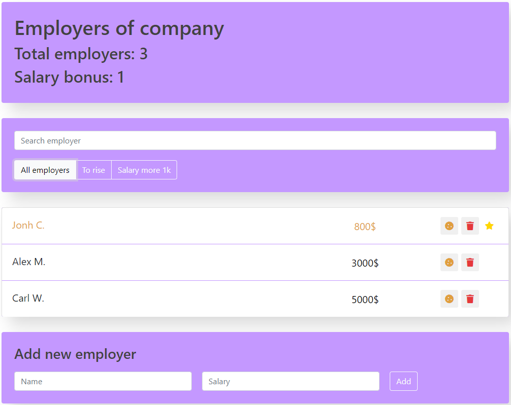

# App - "companyEmployers-miniApp"

Stack: React / Java Script / HTML / CSS (SASS) / Webpack

\
Web application with various modules:
- Search employer;
- Tab-filter;
- Add new employer;
- Interaction with the selected employee: salary increase/editing/remove.

### Preview

 

## Scripts for start project

In the project directory, you can run:

### `npm start`

Runs the app in the development mode.\
Open [http://localhost:3000](http://localhost:3000) to view it in your browser.

The page will reload when you make changes.\
You may also see any lint errors in the console.
